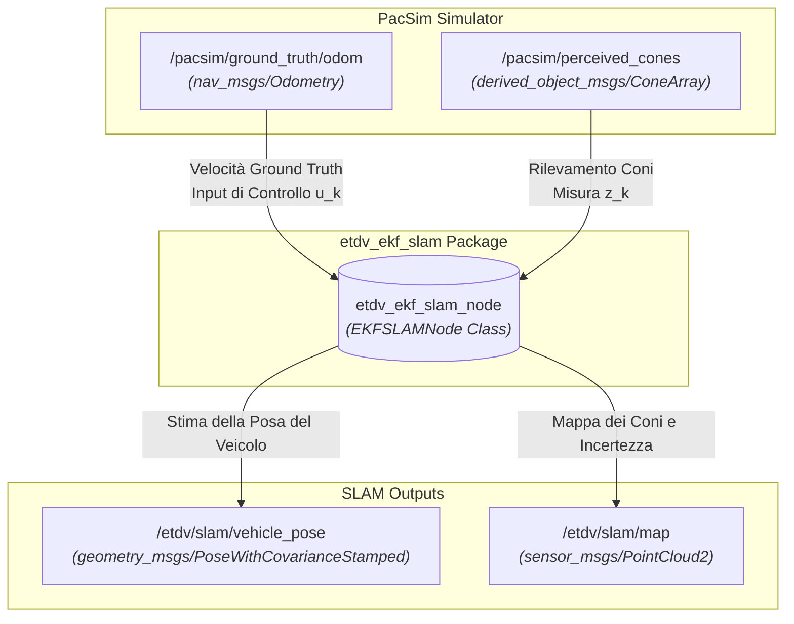

# etdv_ekf_slam

## Descrizione Generale
Il pacchetto `etdv_ekf_slam` implementa un algoritmo di Simultaneous Localization and Mapping (SLAM) basato su un Filtro di Kalman Esteso (EKF). Sviluppato all'interno del workspace `pacsim_ws`, il nodo si integra con il simulatore *PacSim* (Formula Student Driverless simulator) per fornire una stima affidabile dello stato del veicolo e generare in tempo reale una mappa dei coni (landmark) presenti sul tracciato.

---

## Architettura e Funzionamento dell'EKF
Attualmente, l'architettura dell'EKF è stata impostata per validare la logica del filtro isolandola dalle incertezze hardware:

* **Odometria (Ground Truth):** Il filtro EKF **non** utilizza i dati provenienti dai sensori modellizzati (come IMU o encoder delle ruote). Al contrario, lo step di predizione (*predict step*) funziona acquisendo direttamente la **velocità ground truth** fornita dal simulatore `pacsim`.
* **Aggiornamento (Update):** La fase di correzione mappa le posizioni dei landmark osservati, basandosi sulla cinematica ideale del veicolo.

Questo approccio permette di testare la robustezza della logica di *Data Association* e la convergenza della mappa senza l'interferenza del rumore di traslazione/rotazione tipico della sensoristica.

---

## Grafo del Nodo (ROS 2 Computation Graph)
Il diagramma seguente illustra l'interfaccia del nodo `etdv_ekf_slam_node`, evidenziando l'architettura attuale che isola la logica del filtro utilizzando i vettori di stato ideali del simulatore come odometria.



---

## Struttura del Codice e Classi Principali
Il pacchetto è strutturato per separare nettamente la gestione del middleware ROS 2 dalla logica matematica del Filtro di Kalman Esteso.

```text
etdv_ekf_slam/
├── config/
│   └── ekf_params.yaml          # Parametri di tuning (Q, R, soglie di Data Association)
├── include/etdv_ekf_slam/
│   ├── ekf_slam_node.hpp        # Wrapper ROS 2 (Subscriber, Publisher, Timer)
│   └── ekf_core.hpp             # Core matematico dell'EKF (Matrici, Jacobiani)
├── src/
│   ├── ekf_slam_node.cpp
│   └── ekf_core.cpp
```

### 1. EKFSLAMNode (ROS 2 Wrapper)
Gestisce l'inizializzazione del nodo, la lettura dei parametri dal file YAML e le callback dei topic:

* **Odometry Callback:** Sottoscrive il topic della ground truth di PacSim. Estrae le velocità lineari e angolari pure e chiama immediatamente il metodo di predizione del filtro.
* **Cone Perception Callback:** Riceve l'array dei coni percepiti rispetto al frame del veicolo, calcola la trasformazione e avvia la fase di correzione dell'EKF.

### 2. EKFCore (Logica del Filtro)
Contiene il vettore di stato accoppiato $\hat{x}_k$ (veicolo + landmark) e la matrice di covarianza $P_k$.

**Vettore di Stato:**
$$X = [x_v, y_v, \theta_v, x_{m1}, y_{m1}, \dots, x_{mn}, y_{mn}]^T$$

---

## Dettaglio dell'Implementazione EKF

### Fase di Predizione (Prediction Step)
A differenza delle implementazioni SLAM tradizionali che integrano gli encoder delle ruote o i dati IMU, il ciclo di predizione è guidato direttamente dalla velocità ground truth di PacSim.

Il modello cinematico a bicicletta (o l'approssimazione uniciclo) viene discretizzato ad ogni intervallo di tempo $\Delta t$ ricevuto dal topic odometrico:

$$x_{v, k} = x_{v, k-1} + v_{gt} \cdot \cos(\theta_{v, k-1}) \cdot \Delta t$$
$$y_{v, k} = y_{v, k-1} + v_{gt} \cdot \sin(\theta_{v, k-1}) \cdot \Delta t$$
$$\theta_{v, k} = \theta_{v, k-1} + \omega_{gt} \cdot \Delta t$$

> **Nota Architetturale:** L'uso dei sensori fisici modellizzati (rumore hardware, drift e slittamenti) è attualmente disabilitato. Questa configurazione permette di isolare ed eseguire il debug della stima della mappa escludendo l'incertezza cumulativa dell'odometria.

### Fase di Correzione (Correction Step)
* **Data Association:** Per ogni cono rilevato, viene calcolata la distanza di Mahalanobis rispetto ai landmark già censiti in mappa. Se la distanza supera la soglia impostata in `ekf_params.yaml`, il cono viene registrato come nuovo landmark, espandendo lo stato $X$ e la covarianza $P$.
* **Aggiornamento di Kalman:** Se il cono è associato a un landmark esistente, viene calcolato il residuo di misura $y_k = z_k - h(\hat{x}_k)$, viene calcolato il guadagno di Kalman $K_k$ tramite i Jacobiani della funzione di misura $H_k$, e lo stato viene corretto.

---

## Analisi dei Commit Sostanziali (Account: GiulioFerr01)
Le modifiche più rilevanti apportate che hanno ridefinito la struttura attuale del pacchetto includono:

* **Integrazione della Ground Truth & Ristrutturazione del Controllo:** Sostituzione dei topic di ascolto odometrico standard con l'acquisizione della velocità esatta da `pacsim` (rimuovendo la dipendenza dai nodi di processing dei sensori) per pilotare la predizione dell'EKF.
* **Modularizzazione del Core EKF e Refactoring Cinematico:** Separazione della classe `EKFCore` dalle dipendenze rigide di ROS (facilitando il testing) e modifica delle equazioni di transizione per adattare la stima all'input ideale.
* **Ottimizzazione dell'Inizializzazione e Tracking Landmark:** Miglioramento delle strutture dati per l'estrazione e l'aggiornamento dei coni nella mappa, implementando una logica di espansione dinamica delle matrici di covarianza nello stato accoppiato per risolvere i problemi di allocazione di memoria.
* **Tuning delle Matrici di Covarianza:** Aggiornamento della matrice del rumore di processo ($Q$) per riflettere l'assenza di incertezza nella velocità.

---

## Sviluppi Futuri
L'utilizzo della velocità ground truth è da considerarsi un'applicazione temporanea per le fasi di test. Le applicazioni e gli sviluppi futuri per questo pacchetto prevedono:

* **Integrazione dei Sensori Modellizzati:** Abbandono della ground truth in favore dei topic dei sensori simulati (LiDAR, IMU, encoder) per replicare fedelmente le dinamiche reali della vettura.
* **Compensazione del Rumore e Dinamica del Veicolo:** Introduzione di logiche di handling per lo slittamento (slip angle) e tuning fine delle covarianze per gestire l'imprecisione dell'hardware reale in vista delle competizioni Formula Student.
