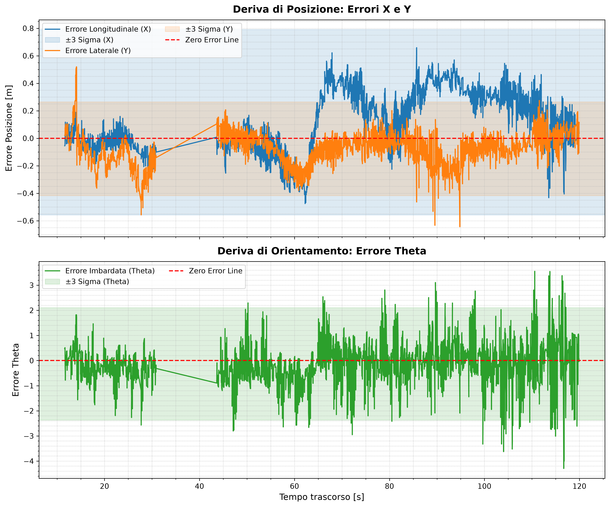
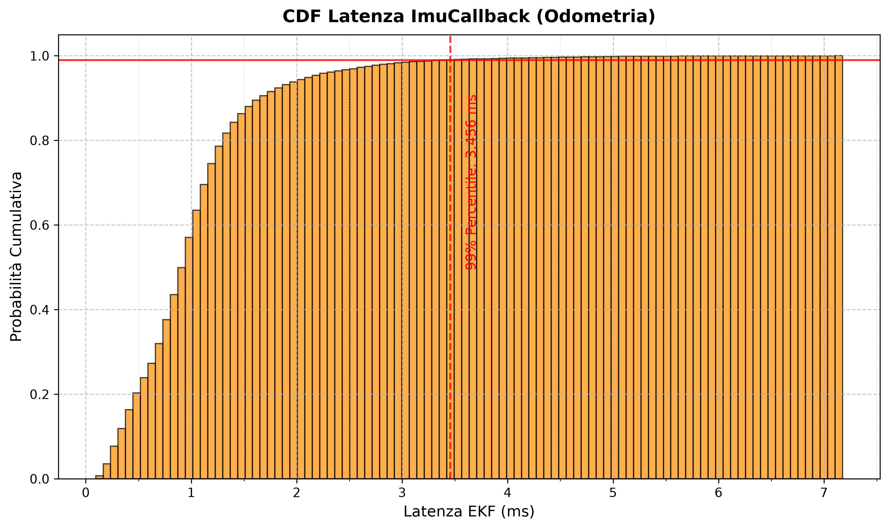

# Current Test Results
Tests were conducted using PacSim simulator on various tracks, debugging RMSE errors on estimated map and position and latency data evaluated at the 99th percentile. 
Here's some of the results: 

-  System Latency (99th Percentile):
  
The system operates well within the Real-Time safety threshold. Odometry updates remain exceptionally lightweight, while LiDAR correction peaks only on highly dense tracks.

| Track Layout | Correction Latency (LiDAR) | Odometry Latency (IMU) |
| :--- | :--- | :--- |
| **FSCZ24** | 7.400 ms | 1.805 ms |
| **FSE23** | 10.412 ms | 2.018 ms |
| **FSG24** | 10.412 ms | 4.400 ms |
| **FSS22** | 5.803 ms | 4.514 ms |
| **Minimum** | 5.803 ms | 1.805 ms |
| **Maximum** | 10.412 ms | 4.514 ms |
| **Mean** | **8.507 ms** | **3.184 ms** |
| **Std. Dev. ($\sigma$)** | **2.289 ms** | **1.475 ms** |

- Estimation Accuracy (RMSE):
  
The table below illustrates the Root Mean Square Error evaluated against the simulator's Ground Truth for the 2D Pose (Euclidean distance $X-Y$), Yaw angle ($\theta$), and global Map estimation.

| Track Layout | 2D Pose Error (m) | Yaw Error (rad) | Map Error (m) |
| :--- | :--- | :--- | :--- |
| **FSCZ24** | 0.473 | 0.860 | 0.967 |
| **FSE23** | 2.001 | 2.859 | 1.538 |
| **FSG24** | 0.272 | 0.742 | 0.386 |
| **FSS22** | 0.705 | 2.092 | 0.776 |
| **Minimum** | 0.272 | 0.742 | 0.386 |
| **Maximum** | 2.001 | 2.859 | 1.538 |
| **Mean** | **0.863** | **1.638** | **0.917** |
| **Std. Dev. ($\sigma$)** | **0.779** | **1.017** | **0.480** |

Here's an example of graphic plot obtained after simulation depicting errors dynamics and the CDF of the latency:

## Future Improvements
- Code refactoring and configurable topics
- Implementation with state machine
- Further test for fine tuning
